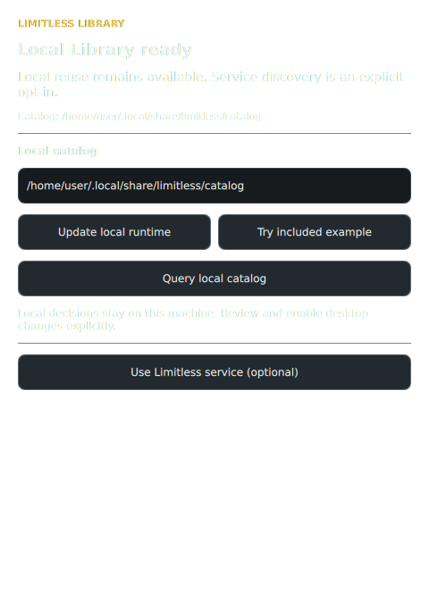

<p align="center">
  
</p>

<h1 align="center">Limitless Library for Omarchy</h1>

<p align="center">
  <strong>Ask before you build. Reuse what fits. Prove it worked.</strong><br>
  Local-first verified reuse for Omarchy customizations and general agent work.
</p>

<p align="center">
  <a href="https://limitlesslibrary.com">Website</a> ·
  <a href="https://github.com/Univeracity/limitlesslibrary">Library core</a> ·
  <a href="docs/COMPATIBILITY.md">Compatibility</a> ·
  <a href="SECURITY.md">Security</a>
</p>

Your agent is about to customize Omarchy. Instead of starting from zero,
Limitless first checks whether approved work already fits this machine and this
task. One concise objective goes in; one exact component, one source-free
method, or a safe “start fresh” comes back.

> **The money shot:** prior agent work becomes reusable infrastructure without
> blindly copying code, leaking a workspace, or making the agent spend more
> time thinking about reuse than the reuse can save.

```text
Intent → query before work → exact component / source-free method / abstain
       → receiver-local verification → observed adoption → useful work compounds
```



## Good work should not keep starting over

Search can find prior work. It cannot establish that the work is allowed,
compatible, unchanged, or actually used.

Limitless Library lets an agent check before material work whether one approved
prior result fits the receiving environment. It returns one of three things:

- an exact component, kept byte-for-byte and verified by the receiver;
- a source-free method to apply freshly in the current environment; or
- a non-disclosing abstention when no safe selection can be made.

This plugin makes that lifecycle feel native to Omarchy. It includes a Quattro
panel and bar widget, a private per-user runtime, a local catalog, automatic
connection to the owner's chosen Omarchy agent where supported, and optional
access to the Limitless Library service. The CLI is available for lower-level
control, but ordinary use stays in the UI.

## Start in Omarchy

Direct installation steps:

1. Choose the agent you normally use under **Setup › Defaults › Agent**.
2. Open **Setup › Plugins**.
3. Add `https://github.com/Univeracity/limitless-omarchy.git` and enable it
   after Omarchy's review step.
4. Select the Limitless `<` button on the right side of the bar.
5. Select **Install local runtime**.
6. Describe what you are about to make or change, then select
   **Query local Library**.

The setup action creates an isolated runtime beneath the user's XDG data
directory. It does not modify the system Python, require elevated privileges,
or connect to a hosted service. It also offers Limitless to the agent selected
under **Setup › Defaults › Agent** when that client has a verified MCP
configuration path. Existing MCP entries are never overwritten.

### MCP setup—without editing MCP files

**Install local runtime** is also the normal MCP setup action:

1. Limitless reads only the agent selected in Omarchy's default-agent setting.
2. For a supported client, it creates its own `limitless-omarchy` MCP entry
   with the exact panel-owned runtime command and local catalog.
3. It reads the entry back and treats it as connected only when the command and
   arguments match.
4. The **Agents** tab shows the result and lets the owner opt additional agents
   in. A collision or unsupported client is reported without changing it.

The connected agent receives three deliberately small tools through that one
connection:

- `limitless_query_before_work` — use the standard Limitless receiver envelope
  for general work, including work unrelated to Omarchy;
- `omarchy_query_before_customization` — call before material Omarchy work with
  only the concise objective already in context; and
- `limitless_register_method` — call after useful work when the saved owner
  policy says it should be retained.

The MCP server itself instructs the agent to query first. No hand-authored JSON,
terminal command, prompt duplication, repository path, or receiver profile is
required from the user. Codex, Claude Code, Grok, and Antigravity CLI have
verified setup adapters; unsupported clients remain untouched.

The Library tab always begins locally:

> Local reuse is available. Opt in for service discovery.

After the owner connects the service, that state becomes:

> Local reuse and service discovery are available.

## What the panel provides

| Surface | Purpose |
| --- | --- |
| **Library** | Query local or opted-in service discovery; configure contribution defaults. |
| **Agents** | See the Omarchy default agent and optionally connect additional supported agents. |
| **Service** | Inspect connection, identity, policy, usage, and account or organization state. |
| **Stats** | View private aggregate Omarchy and general-Limitless activity. |
| **?** | Read the project story, goals, license, and official links. |

Queries never install or enable a desktop change. An exact component uses a
separate review → install disabled → enable lifecycle through Omarchy's native
validator. A source-free method is applied locally without transporting another
user's source. If eligibility, rights, compatibility, integrity, or selection
is uncertain, Limitless abstains and the agent starts fresh.

The Stats surface stores aggregate counters only. It does not store objectives,
prompts, paths, IDs, catalog metadata, or result contents.

## Local first; service optional

The plugin works without an account or service connection. Local decisions,
catalog material, settings, and evidence remain under owner-controlled XDG
paths.

Selecting **Connect to Limitless Library service** performs one credential-free
activation flow. The client verifies the release-pinned service identity, root
history, policy digest, protocol, and result-signing keys before saving an
anonymous installation identity. No API key, profile download, terminal, or
agent-side setup is required.

Service queries send the short objective and minimum declared receiver context.
The objective is delivered to the panel-owned process over bounded stdin,
cleared after dispatch, and kept out of argv and local files. Signed results
must be current and bound to that exact query, policy, and receiver. If the
service is unavailable, local reuse remains available.

Connecting is not publishing. Sharing is controlled separately in **Library
settings**.

## Capture work without taxing the agent

The Omarchy-aware MCP exposes query first and a compact
`limitless_register_method` tool second. Registration requires only a name and
steps. Limitless adds the opaque ID, digest, lineage, immutable local record,
and catalog projection, then returns a short reference rather than echoing the
method into the agent context.

Owners choose both the destination and who initiates registration:

- **Off** — do not register new reusable work.
- **Local** — keep it private to this installation.
- **Team / Organization** — retain the intended scope for an account-backed
  sharing boundary.
- **Public** — publish only through the verified service policy.

Registration can be **Manual**, **Agent-mediated**, or **Automatic**. Saving
Automatic + Public is explicit standing authorization for qualifying
source-free methods. Local registration stays fast; transfer is resumable and
does not block the originating agent. A policy change pauses publication until
the owner saves against the new verified digest.

Methods are independently authored and source-free. Exact-source publication
is a separate owner choice. Local paths never enter public method material;
optional public HTTPS references may accompany it.

## Agent support

The panel follows Omarchy's current default-agent setting and can optionally
target additional agents. Each client is reconciled independently: an
unsupported or changed client produces a local report without blocking the
others.

**Disconnect plugin-owned agent connections** removes only entries whose exact
command still matches the descriptor created by this plugin.

The normal plugin-owned MCP connection supports both Omarchy customization and
general Limitless work. The separate `provider` command remains available only
as advanced, generic-only control for an owner-selected catalog; it is not a
second package or a required second connection.

## Optional command-line control

The UI is the normal path. For diagnostics, automation, or direct MCP setup:

```bash
runtime_cli="${XDG_DATA_HOME:?}/limitless-omarchy/runtime/bin/limitless-omarchy"

"$runtime_cli" status
"$runtime_cli" query --catalog ./catalog \
  < /path/to/ephemeral-local-query-input.json
"$runtime_cli" mcp --catalog ./catalog
"$runtime_cli" provider --catalog /absolute/path/to/general-catalog
"$runtime_cli" validate-plugin .
```

Managed queries and contribution operations also accept bounded JSON on stdin.
Run `limitless-omarchy --help` for the advanced review, installation,
enablement, publication, withdrawal, and alternate-profile controls. Paths,
objectives, and policy acceptance are kept out of process arguments wherever
they could reveal user work.

For offline development against a local Limitless Library checkout:

```bash
python3 -m pip install --no-index --no-deps \
  runtime/wheels/limitless_library-0.1.0a0-py3-none-any.whl
python3 -m pip install --no-deps -e .
```

## Remove it

Use **Setup › Plugins › Remove** or:

```bash
omarchy plugin remove univeracity.limitless-library
```

Omarchy disables the plugin before removing its reviewed Git checkout. The
runtime and catalog are owner data, so removal does not silently delete them.
An owner who wants a complete cleanup can inspect and remove the exact
`XDG_DATA_HOME/limitless-omarchy` and `XDG_CONFIG_HOME/limitless-omarchy`
directories afterward.

## Trust and security boundary

- Omarchy shell plugins run unsandboxed; review the repository before enabling
  it.
- Plugin installation does not run a custom install hook.
- Runtime setup is an explicit UI action and does not cross an elevated
  privilege boundary, create a system service, or mutate the system Python.
- Before setup touches the isolated runtime, a standard-library verifier checks
  the complete dependency lock and both release wheels against committed
  SHA-256 digests. Setup accepts only hash-approved binary dependencies and
  installs the reviewed local wheels without an index, dependency resolution,
  Git, or a package build.
- Local query derives a minimal receiver profile and does not crawl arbitrary
  desktop configuration, prompts, screenshots, command history, or workspaces.
- Exact bytes are installed without overwrite and enabled only after separate
  receiver-owned verification.
- Service discovery and publication require release-pinned trust material and
  fail safely when it is absent or invalid.

Please report security issues through [SECURITY.md](SECURITY.md), not a public
issue.

## Marketplace verification

The repository includes the root manifest, README, Apache-2.0 license, owned
preview, safe removal instructions, native Omarchy validation, and current
marketplace static-baseline preflight.

The current baseline reports no findings and one disclosed review capability:
`package-manager`. That capability exists because the explicit **Install local
runtime** action invokes Python's package installer inside the panel-owned
virtual environment. The complete graph is version- and hash-locked, binary
only, and the adapter and core are reviewed local wheels. Setup runs no package
build or mutable Git dependency. It is not an Omarchy install hook, does not
request elevated access, and does not alter the system Python.

See [marketplace submission notes](docs/MARKETPLACE-SUBMISSION.md) for the exact
review boundary and [runtime smoke testing](docs/RUNTIME-SMOKE.md) for the
real-session validation path.

## Develop and verify

```bash
python3 -m pip install --no-index --no-deps \
  runtime/wheels/limitless_library-0.1.0a0-py3-none-any.whl
python3 -m pip install -e '.[dev]'
python3 scripts/verify-runtime-bundle.py --root .
pytest
ruff check src tests .github/scripts
ruff format --check src tests .github/scripts
bandit -r -q src
omarchy plugin validate .
```

The bundled public Limitless Library wheel is tied to a full Git commit and an
exact digest. CI also pins the Omarchy validator and marketplace baseline so a
moving upstream cannot silently redefine a passing release.

## Project boundary

| Layer | Responsibility |
| --- | --- |
| [Limitless Library](https://github.com/Univeracity/limitlesslibrary) | Generic local reuse, Work Capsule contracts, MCP/CLI surfaces, receipts, and conformance. |
| **Limitless Library for Omarchy** | Quattro UI, Omarchy receiver profile, local catalog, agent setup, native verification, and optional service client. |
| Limitless Library service | Fast public/shared discovery, identity, policy, scopes, revocation, coordination, and managed verification. |

Limitless Library for Omarchy is an [Apache-2.0](LICENSE) Univeracity project.
